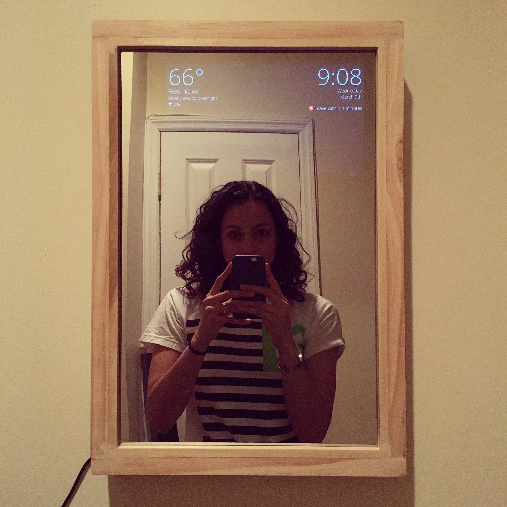
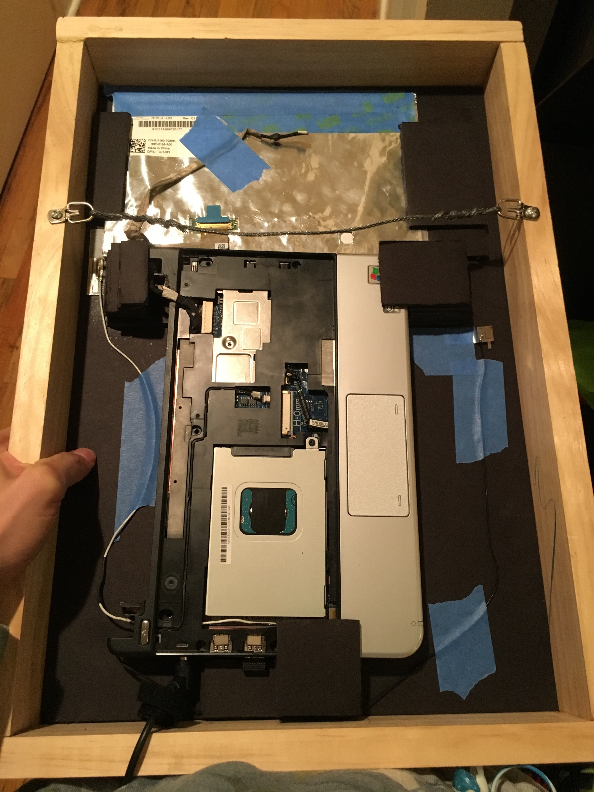
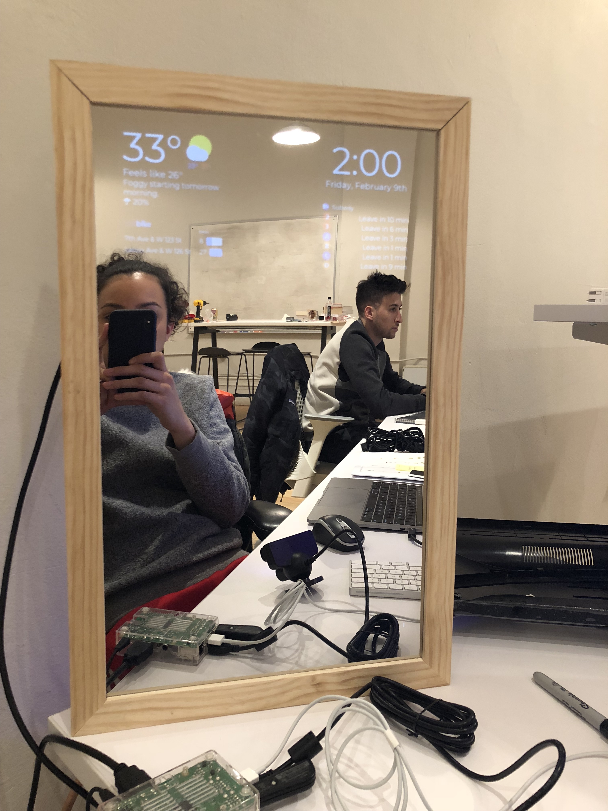

I created a smart mirror for my apartment. This display hangs in my apartment and displays information useful at a glance--current time and date, the day's weather forecast, personal calendar events, nearby subway times, Citibike dock availability, and daily scheduled reminders.

#### V1 (2016)

I created the first non-interactive prototype using an old Dell netbook, plastic two-way mirror, and a custom-made wooden frame.

The software ran a Node.js server on the backend and a React.js front-end. Glancing at it while getting ready quickly became a part of my morning routine.

#### V2 (2018)

The newest version is interactive via voice recognition (albeit a very crude version of it, currently). It is an Electron app running on Raspberry Pi that also utilizes React.js for the UI and has a much larger 1080p display.